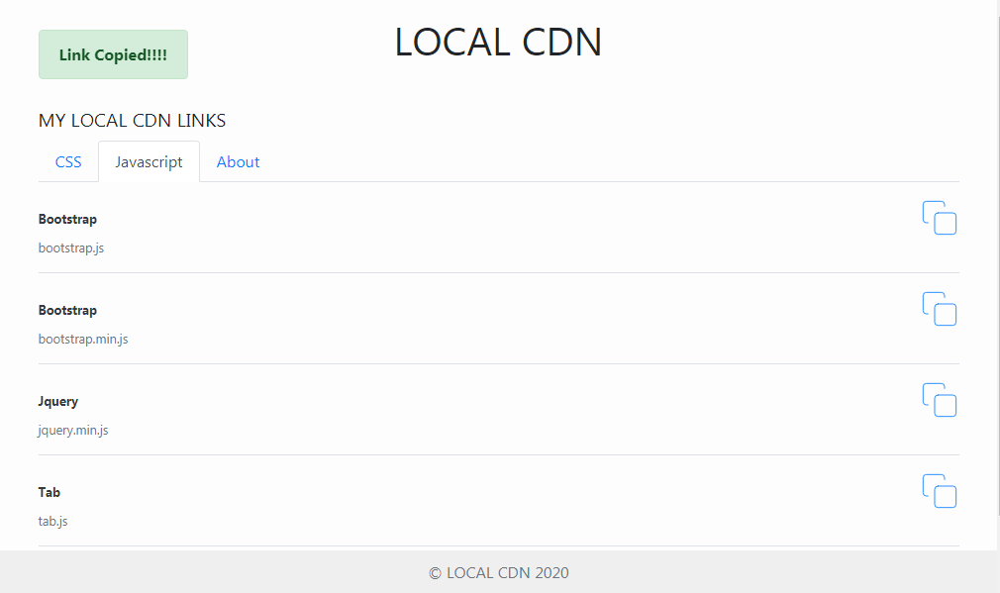

# LOCAL CDN

## What is Local CDN ?

**LOCAL CDN** is a local content delivery network like **cdnjs** which allows you to run all your commonly used **CSS and Javascript** files from a single server offline on your local machine instead of having multiple and lots of different files in different folders serving the same purpose

## Who is Local CDN for ?

Local CDN is mostly for frontend developers or developers that work on the frotend.

## Why Local CDN ?

Most developers ( people like me ) when writing code or when downloading templates, we do download all css files and jquery files along. After downloading 7 templates which all have bootstrap in it, the user gets 7 bootstrap files. So with **LOCAL CDN**, you can run all the 7 templates with just one bootstrap file which pretends to be a bootstrap file from the cdn.

## Using Local CDN ?

To get Local CDNs, run  
>```git clone https://github.com/Qudusayo/local-cdn.git``` in your terminal  

Then  change directory to Local CDNs
>```cd local-cdn```   

Install required packages by running  
> ```npm install```

To start up your server, run
> ```npm start```

## Updating your Local CDN ?  

You can easily update your packages by moving your new file to the css folder or js folder  
**Quick Folder Structure**  
.  
├── static  
│   └── css   
│   └── jss   

## Usage

After downloading and starting the server, click on the copy symbol to copy the the link to any file.  
 

### CONTRIBUTING

Its an open source prroject open for contribution.
